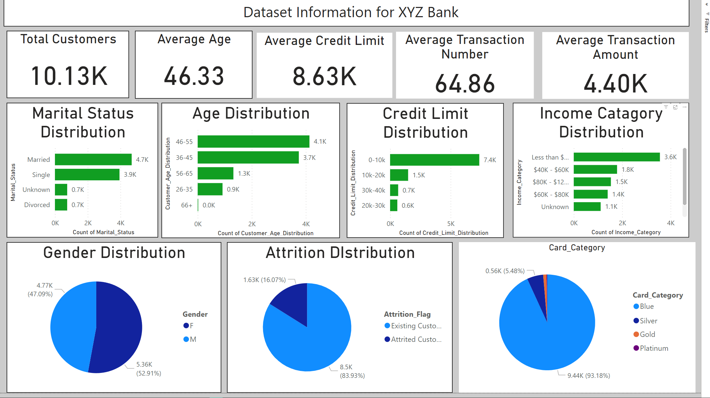
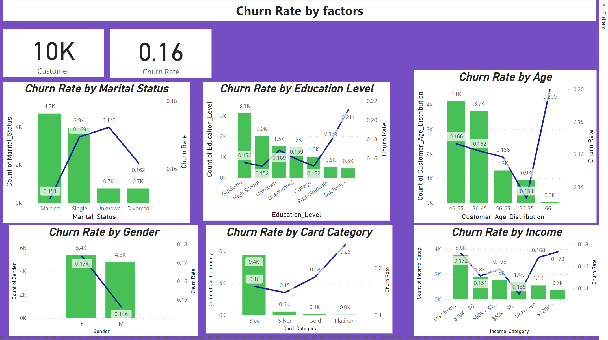
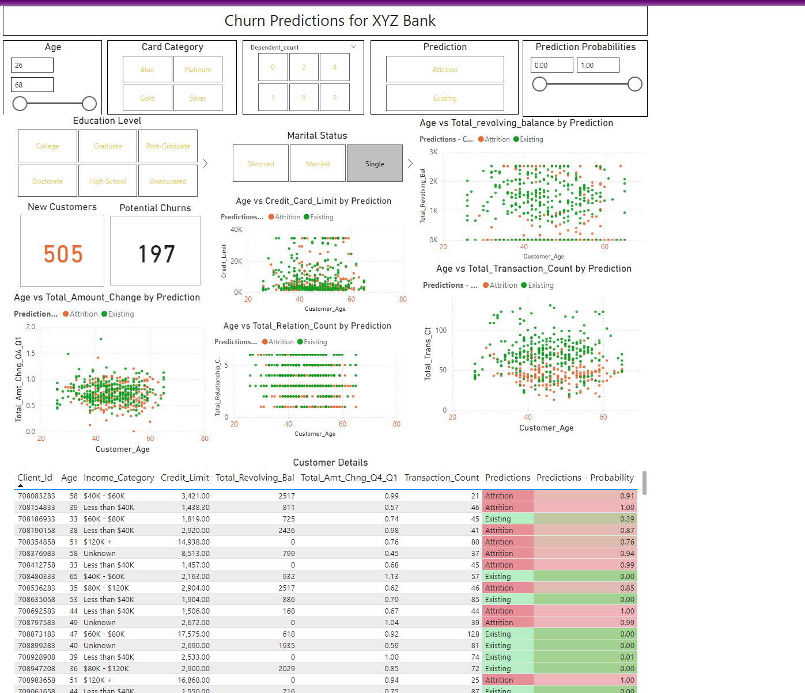

# 🚀 Customer Churn Prediction with Power BI & Python

## 📑 Table of Contents
1. [Project Overview](#project-overview)
2. [Key Features](#key-features)
3. [Technologies Used](#technologies-used)
4. [Dataset](#dataset)
5. [Exploratory Data Analysis (EDA)](#exploratory-data-analysis-eda)
6. [Model Building](#model-building)
7. [Power BI Dashboard](#power-bi-dashboard)
8. [Predictions & Results](#predictions-results)
9. [Output File](#output-file)
10. [Conclusion](#conclusion)

---

### Project Overview

This project focuses on predicting customer churn (i.e., identifying customers likely to leave a service) using historical data. It combines Python for data preprocessing, machine learning, and Power BI for creating interactive dashboards, enabling organizations to take proactive measures for customer retention.

---

### Key Features

- **Data Exploration**: Analyze customer demographics, transaction behaviors, and churn patterns using Python.
- **Machine Learning Model**: Build a predictive model for churn classification with Scikit-learn.
- **Power BI Dashboard**: Visualize churn predictions, trends, and key metrics in an interactive Power BI dashboard.
- **Real-Time Insights**: Provide actionable insights for data-driven decision-making and proactive retention strategies.

---

### Technologies Used

- **Python**: For data preprocessing, analysis, and building machine learning models.
- **Power BI**: For designing and publishing an interactive dashboard.
- **Pandas & NumPy**: For data manipulation and numerical operations.
- **Matplotlib & Seaborn**: For data visualization.
- **Scikit-learn**: For building, training, and evaluating the machine learning model.
- **GridSearchCV**: For hyperparameter tuning of machine learning models.

---

### Dataset

The dataset, sourced from [Kaggle](https://www.kaggle.com/datasets/anwarsan/credit-card-bank-churn), includes customer demographic data, transaction information, and churn status. Key columns in the dataset:

- `CLIENTNUM`: Unique customer identifier.
- `Attrition_Flag`: Whether the customer has churned (Yes/No).
- `Customer_Age`, `Gender`, `Income_Category`, `Card_Category`: Customer demographics.
- `Total_Trans_Amt`, `Total_Trans_Ct`: Customer transaction metrics.
- `Avg_Utilization_Ratio`, `Credit_Limit`: Key metrics of customer behavior.

---

### Exploratory Data Analysis (EDA)

- **Income Category vs. Card Category**: Most customers prefer Blue cards, regardless of income.
- **Income vs. Credit Utilization**: Higher income correlates with lower credit utilization.
- **Revolving Balance vs. Income Category**: Revolving balance remains consistent across income groups.
- **Churn Analysis**: Customers with lower income and education levels (especially Graduates) have a higher likelihood of churning.
  
### Observations:
- **Age**: Customers aged 40-50 are more likely to churn.
- **Income Category**: Those earning less than $40k are more likely to churn.
- **Card Preference**: Most churn occurs among Blue cardholders, but Blue cards are predominant.

---

### Model Building

- **Label Encoding**: Applied to categorical columns to convert them into numerical format.
- **Train-Test Split**: Data split into training (80%) and testing (20%) sets.
- **Algorithms Tested**: 
  - Logistic Regression
  - Random Forest
  - Gradient Boosting
  - AdaBoost
  - Decision Tree

- **Model Selection**: Gradient Boosting and Random Forest performed best across key metrics (accuracy, recall, precision, F1-score).
  
### Hyperparameter Tuning:
- **Grid Search**: Optimized the Gradient Boosting and Random Forest models to improve performance.

---

---

### Predictions & Results

- **Best Model**: After tuning, Gradient Boosting provided the best results for predicting churn.
- **Output**: The model outputs churn predictions, probabilities, and actual results.

### Key Results:
- **Churn Prediction**: 1 (Churn), 0 (No Churn)
- **Churn Probability**: Percentage likelihood of churn.
- **Actual Results**: Ground truth for comparison.

---

### Output File

The results are stored in a CSV file (`ChurnPredictionsOutput.csv`), containing:

- **ClientNum**: Customer identifier.
- **Predictions - Churn or Not**: 1 (Churn), 0 (No Churn).
- **Predictions - Probability to Churn**: Probability percentage.
- **Actual Result**: Actual churn status for validation.

This CSV file can be imported into Power BI for visualization and further analysis.

---

### Power BI Dashboard

The **Power BI dashboard** provides a comprehensive, interactive view of the churn predictions and analysis. It includes several key features and visualizations that allow users to explore churn patterns and analyze the data.

### 1. **Dataset Information**  
The first screenshot displays a summary of the dataset, showing key customer attributes and insights. This section is designed to provide an overview of the data before diving into the churn analysis.

![Dataset Information]

  

### 2. **Churn Rate by Factors**  
This section visualizes the churn rate segmented by different factors such as income category, education level, and card type. It helps in identifying which customer segments are more likely to churn based on various attributes.

![Churn Rate by Factors]

  

)

### 3. **Churn Prediction Dashboard**  
This is the core of the Power BI dashboard, where the churn prediction model is integrated. The dashboard allows users to select specific features and view detailed statistics of individual customers. It displays the prediction of whether a customer will churn or not, along with the probability and other relevant metrics. The prediction results are aligned with the churn data, helping businesses understand the likelihood of customer attrition in real-time.

![Churn Prediction Dashboard]

  

)

These visualizations enable businesses to take actionable insights based on real-time churn predictions and make data-driven decisions to reduce customer attrition.

### Conclusion

This project demonstrates a powerful approach to predicting customer churn and visualizing insights using both machine learning and interactive Power BI dashboards. By leveraging Python for data analysis and model building, and Power BI for visualization, businesses can proactively address churn and improve customer retention strategies.
